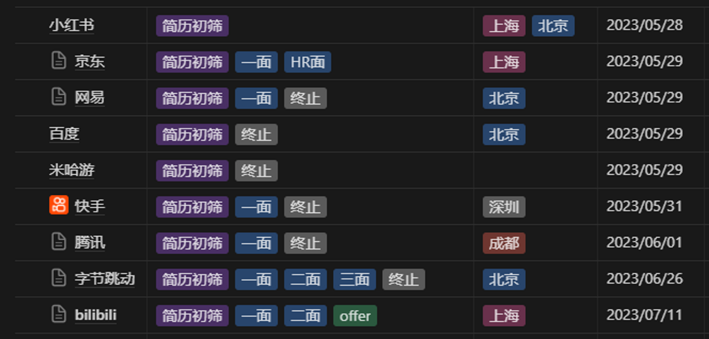

> 历经一个半月，终于找到了一份实习，虽然无缘字节，但来到了心心念的上海。相对于大厂的Title，B站的技术栈其实更适合我，工作环境也还不错，同时是我天天都要刷的app，所以也算是双向奔赴了吧。周记鸽了好几周了，该写起来了。
> 

在面试了诸多大厂后，被B站收留了，B站是我投的最后一个公司，因为有了前面的面试经验，所以也是准备的最充分发挥最好的一次，面试官评价很高，惊喜的是技术栈也和我较为相符，因为其他大厂都是在维护老项目居多，要再学习OC语言，B站这边则是Swift为主，在更新老控件的时候把OC顺便干掉。经历了一个半月的面试折磨后，终于拿到了实习Offer。在此来复盘下求职过程。

在我完成了一些学校课程要求后开始准备实习的事。临近5月底，距离放暑假还有一个月，本打算在这一个月内找到实习，没想到远没我想的那么简单。首先是时间点，秋招的时间是八月，一般实习都会要求三个月往上，所以理想的实习时间应该是5月份或者更早。而开始准备到拿到offer入职可能要花一个月时间，大佬可能会比较快，（我花了快两个月），所以开始准备找实习应该再提前一个月也就是4月份。当然，这个时间点也有一定运气成分，因为B站一开始其实是没有符合我的岗位的，在6.29才放出来招聘信息，就算我在准备早点也不一定有合适的offer，但是早点准备还是没错的。否则就会和我一样面临着边实习边准备秋招的问题。

## 聊聊我的面试过程

背景：

- 岗位：iOS研发
- 学历：双非科班本硕
- 项目：独立开发两个app 曾获AppStore等推荐
- 比赛：无
- 实习：一段小公司java实习 约等于无吧

### 出师不利

好了，回到开始，5月28号，我的第一份简历给了小红书，但没想到截止到写这篇文章的时候，都还没理我，一直在简历初筛，应该是筛部门不差人。然后我把手机里能看到的app都去官网投递了个遍，包括BAT。

因为毫无面试经验，本想先在BOSS上投点小公司积累下面试经验，没想一个面试都没有，唯一一个面试听到我能独立完成app后便伸出橄榄枝，希望我加入他们，因为他们正好需要我的技能，但我实习的目的是为了学习的，希望是一个输入过程而不只是输出，于是就婉拒了。开始的顺利让我放松了警惕，但随后再无面试邀约。

大概两星期后，快手最先开始约面试，网易随后。因为从没面试过大厂，经验不是很足，两次面试都出奇的顺利（自我感觉），因为没感觉问什么很难的问题，但是算法题写的一塌糊涂，现在回过头看看怎么能连反转链表都写的那么丑呢。但都很快被终止流程，后来才意识到当你觉得面试提问很简单的时候，很可能并不是面试很顺利，而是基础的知识回答的并不好，导致面试官没有再深入提问的兴趣。意识到这个问题后我开始背八股，刷力扣，但因为时间太短，随后腾讯的面试挂的很流畅。这几次面试让我知道了自己的不足，开始沉下心来复习。

### 小起大落

很快就到了六月底，京东的流程也开始推进，面试的是jd的武汉部门，有了一定基础的我已经可以和面试官聊的有来有回了，但还是感觉差点火候，算法题也发挥的一般，没想到居然给过了，jd的面试只有两面，技术面+hr面，本以为hr面就没啥了，没想到迟迟等不来面试邀请，过了一周后发现直接被泡人才库里了，盲猜是被排序掉了。同时投递的第三份字节简历终于评估通过了，开始紧张的准备中，虽然广度有了，但深度不够，在面试中也满满暴露出来，最后侥幸的过了，二面也是类似的情况也侥幸过了，但好运没能一直继续下去，三面虽然是我觉得表现的最好的一次，但被惨挂，现在想想还是有点意难平，应该是参考前两面的面试评价给出的结果，其实一开始就没报太大希望，但是一面二面通过给了我太大期望，如果一面就给挂的话反而没这么难受。

### 柳暗花明又一村

因为字节的前两面的通过给我了太大希望，一直在全力准备字节的面试，没再投递其他公司，在被挂后也暂时没了其他面试安排，于是开始摆烂。在和朋友出去玩的时候jd又开始约面试了，应该是被其他部门捞了，随后在看B站投递的状态时发现有新的岗位开始招聘了，于是又投递了一份，没想到很快就被处理了，约到了下周的面试。jd和b站成了我最后的希望，再面不上暑假也要快过去了，该准备秋招了。jd捞我的是上海的部门，流程比较顺利，业务面-》hr面，等结果。

同时B站的面试也开始了，算法题是leetcode上的原题，应该属于中等难度吧，因为做过直接秒了，随后聊项目、问八股，各个方面都是我这段面试以来回答的最好的一次，第二个工作日告知面试通过，二面约到了当天下午。二面只聊了聊项目和一些思考，很快便结束了，没问八股，比较好奇问了下原因，告知和一面面试官聊了下我的情况，更多的是了解下思维能力等，应该是一面表现的不错。结束后不到五分钟hr打来电话说面试官给的评价比较高，沟通下offer事宜，真的激动！终于有了第一个offer。

至此面试就告一段落了，虽然B站的实习转正名额还没下来，但各个方面都比较满意，如果不看大厂的title的话，B站确实是最适合我的了，这么久也算有了个满意的结果。

## 一些总结

- 内推码是为了简历尽早被看到，具体能不能通过面试还是要靠个人实力。
- 就算是双非，简历中有匹配岗位的亮点的话，大部分公司还是能有面试机会的的。但是有可能会在最终排序的时候被排序掉。所以面试需要发挥的很好。
- 珍惜每次面试机会，如果没有准备好，建议把时间往后推一下，部分公司（字节为例）每次面试都会留下面评，如果面评很差，很可能下次在投递连简历都过不了。部分公司会限制投递次数，如网易半年内不能投递同一岗位。
- 面试过程中想办法往你会的点引，尽量把自己擅长的展示出来。
- 面试官会一直深挖一个方向的知识，直到你不会了，再换问题。而如果你面试完觉得问题都很简单，那说明前面你的回答可能不太理想，面试官觉得没必要更深的问下去了。（亲身经历
- 如果不止一轮技术面，比如字节三轮技术面+1轮hr面，那面试完一定要把没答好的问题好好准备下，在之后的面试中可能会提到，来评估你是否复盘过
- 尽可能把自己所了解的展示出来
- 面试是双向沟通，把面试官和你的对话比重控制在3比7
- 写算法题之前先和面试官沟通思路，不要自己闷着头想，多和面试官交流，哪怕刚开始思路是错的也没事。
- 反问环节一般能体现出来你最关心的是什么，可以聊聊技术栈、成长路线之类的。薪资一般是hr或者发offer的时候讨论的，不要在面试过程中问，问了也没结果，反而会拉低印象。如果不是一问三不知的话，可以问下之后的学习建议，大厂的面试官感觉还是挺和蔼的（我遇到的是这样），虽然可能没给通过，但是还是愿意给你写建议的。
- 如果被挂了，不一定是发挥不好，也可能只是和岗位不匹配。

准备收拾行李奔赴上海！