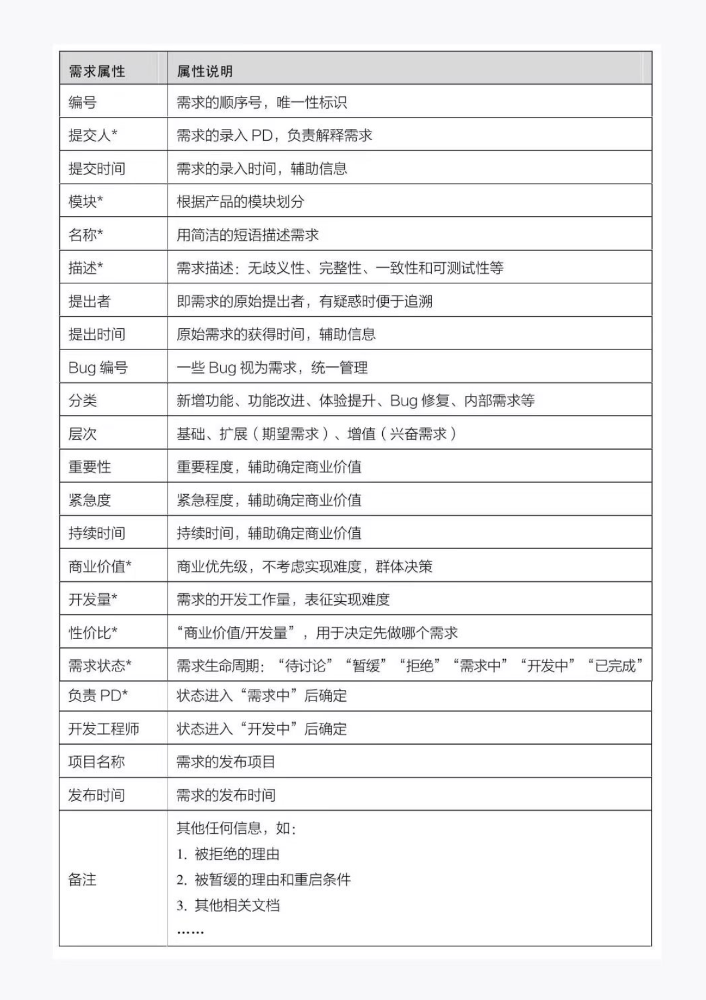
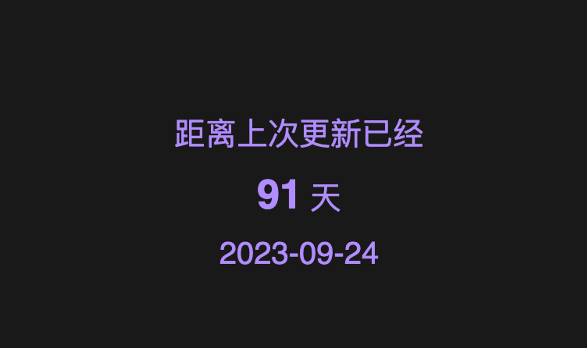

> 感觉会看到这篇周记的都是想来催更的吧，那以后就先讲下和app有关的情况了。来北京后该忙的也都忙完了，要开始恢复更新状态了，目前是给自己定了ddl，和对后续更新的期望。
> 

## 事线：迭代周期调整为双周



不知不觉又拖更了三个月了，终于要开始恢复更新啦，但是可能要让大家失望的是没有特别大的功能加入。我实习入职也有段时间了，也慢慢开始参与到完整的需求当中，故决定调整下我个人的工作流程。下文会大致讲一下，一个比较重要的决定是未来会实行每两周更新一次，也就是说更新日期不再受开发进度约束，每次迭代周期内会有很多个小小需求，理论上来说也就不会因为某些功能没完成而导致其他的功能或修复也无法上线。加上ddl之后也算是对我的一个约束吧，欢迎大家继续催更。

## 健康迭代

### 规范开发习惯




由于从来都是自己一个人在写代码，对于我自己的项目来说，Git更多的是防止丢失代码，而不是做版本控制，一直没有真正的深入使用Git（我检讨），所以一直以来使用习惯不是很好，包括不限于很少切分支开发、commit信息乱写等等。

当然自己是自己，在真正的工作当中肯定是严格遵守Git规范，做一个不遭人嫌弃的程序员，但长时间养成的陋习还是时不时的会体现出来，比如某几次提交是同一个地方，就想偷下懒，写的不是很易读，计划代码没问题后rebase下就万事大吉了。但是没想到跑一次pipeline的时间太长了，剩下的时间已经不够我rebase重新跑pipeline了，于是master分支里可能就留下了我一次没那么好看的commi。（自从熟悉了rebase后就愈发依赖了。。 感觉不是什么好习惯，得改掉）。

前段时间把自己的代码从Github换到了GitLab，趁着提交的commit还不是很多准备重新整治下自己的坏习惯，以后严格遵守Git规范。目前比较明显的就是分支和commit。

commit提交规范：

```swift
feat：新功能（feature）
fix：修补bug
docs：文档（documentation）
style： 格式（不影响代码运行的变动）
refactor：重构（即不是新增功能，也不是修改bug的代码变动）
test：增加测试
chore：构建过程或辅助工具的变动
```

branch命名规范：

```swift
feature 用于开发新功能
fix 用于修复一批相关性bug
hotfix 用于临时修正线上版本问题紧急发版
master 只存放可供发布到外网的代码
release 用于版本发布
```

以前都是以版本切分支的，一个版本开发完后合入master，这样的问题十分明显，就是一旦开始了开发，功能的代码都是穿插着来的，一旦某个功能卡壳了，或有变动，很难从主代码中把这一部分剔除出去，就只好等这个功能解决了再考虑发布版本，以后将修改为一个功能一个分支，这样能够确保每个功能开发完后，我的主分支都是一个稳定版本，随时可以打包发版本，或是切分支开发别的需求。

### 规范需求池

正巧另一位同学最近在看产品相关的书，给出了一些和需求相关的规范：


当然以上都是面向团队成员比较多的规范，实际开发中我们会根据实际情况做选择。

### 定期发版

以上都是用户端感知不到的，更多的是内部研发流程的优化，而还有一个想法就是学习下我司的发版模式：班车制。也就是固定每隔一段时间发一个版本，需求根据难度以及工作量排期，确定发版计划，如果有功能未按时交付，则推迟到下一个版本。

这样做一个好处是用户端能够感知到开发团队是有在维护的。另一方面如果遇到某个需求有变，这样也不用一直在这一个需求上耗着，迟迟更新不了。同时对于开发者也就是我来说，需求的一些信息扩充的更详细后，只需要有一个合理的排期就好，不再会遇到几个大功能堆在一起，开发的时候才发现工作量比较大，然后开始肝代码的情况。无论对用户还是研发团队来说都是一个更为健康的状态。

下周见！