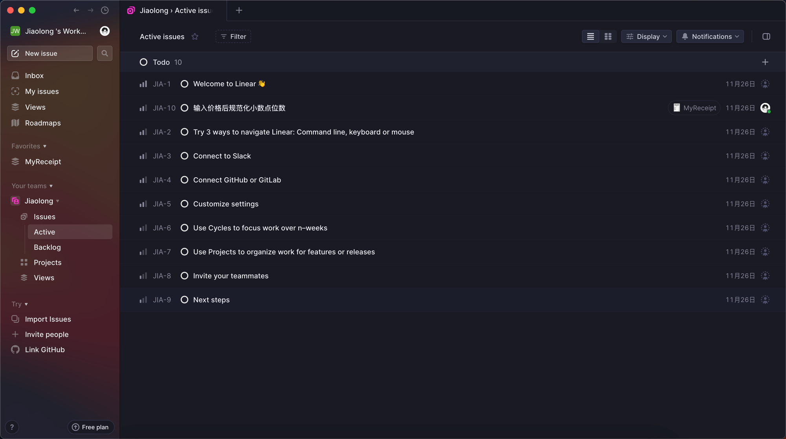

## 有点意思

之前刷到大熊的动态，发现他在用一个叫linear的项目管理工具，由于当时刚决定用notion来管理项目，就没细看，今日又想起来决定下载探究一番。

一个颜值很高的项目管理工具，类似GitHub的issue体系，感觉很不错的样子。

收费模式：

免费账户只能有250个issue。最低的订阅价格为$10/月/人，如果按年付费优惠至$8。

因为之前一直在个人开发，没关注过收费模式，前段时间找到了个小伙伴一起协作，由于资金的不足，暂时用的notion共享文档的方式白嫖协作，但是肯定是没有专门的协作工具好用的。

之前也探索过不少产品，但是都不是很满意，一开始想用飞书的，可能是有字节的背景，让我一度觉得它很好用，但当真的运作起来后发现很难用，功能臃肿，并且看什么文档了是跳转到外部浏览器的，很出戏，可能更适合企业级的协作。

其他很多项目管理的产品感觉更多的是部门间的协作，都是面向企业级的，很少有小团队的，要不然就是客户端不够好用。

同样的，linear比较遗憾的一点就是客户端目前只有macOS，还没有app，感觉以后出app受众会更大些。

因为感觉很类似GitHub的issue，所以对于我一个开发者来说很喜欢这个工具，但今后时候会投入到工作流中还需要再考虑，毕竟这些都只是工具，等把notion里的任务都给完成了再考虑换工具吧。