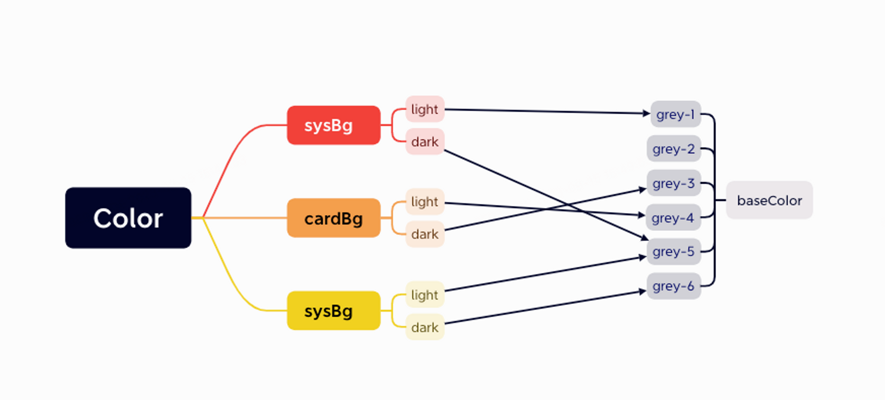

把颜色资源重新搞了一下

### 早期方案：以场景名字定义颜色

assert对应具体颜色，如cardBg

优点：在assert里可以实现自动亮暗模式转变，不需要在代码层进行模式判断

缺点：如果有复用颜色会很麻烦，如果用同一个颜色资源，有可能会出现未来有调整影响的地方太多了，并且名字会有歧义，不够准确。如果其他地方有用同一个色值的需要再次找到这个色值并复制过去，直接取value赋值，而不是通过key取value。

### 优化方案一：以颜色属性命名

优点：其实界面的颜色全部取自这一组基础颜色中，所以只需要指定好是几号颜色就好。未来如果有需要调整颜色，所有使用同一颜色的都会跟随修改。

缺点：由于具体应用后的颜色的亮暗模式并不是一一对应的，比如我在某位置的亮是grey-1，暗为grey-7。而另外一个元素的亮同样为grey-1，但暗想要的确实grey-9。即无法适使用自带的assert来实现自动亮暗切换。也就意味着我需要在代码里指定某个位置的亮暗该是什么色号。于是发现我其实还是需要再封装一组颜色来具体到元素名，回到了起点，更糟糕的事我需要手写逻辑来判断亮暗切换，放弃了SwiftUI的特性，（并且在尝试了几个设计方案后始终没有被找到一个比较理想的代码实现）

其实我发现我需要的只是设定好一系列色值，然后在之后的每个具体颜色上从这些色值中做选择，所以其实最符合的应该是设置一组预设。于是我找了下果然在色盘中找到了自定义预设选项。

### 最终方案：场景+颜色

在色盘里预设好基础色系如：Grey-1、grey-2、…、grey-10。在asert里以名称创建颜色，选色时直接从预设好的色系中选择。

实际使用中如果出现了想要复用但需要改一个更通用的名字时就不要再思考了，新建一个新颜色和新的更准确的名字，一来可以避免需要改动以前的名字，而来如果未来只需要修改这个地方的颜色也会很容易，因为是从预设中选值，所以新建的过程不会很麻烦。

大概是这个样子

