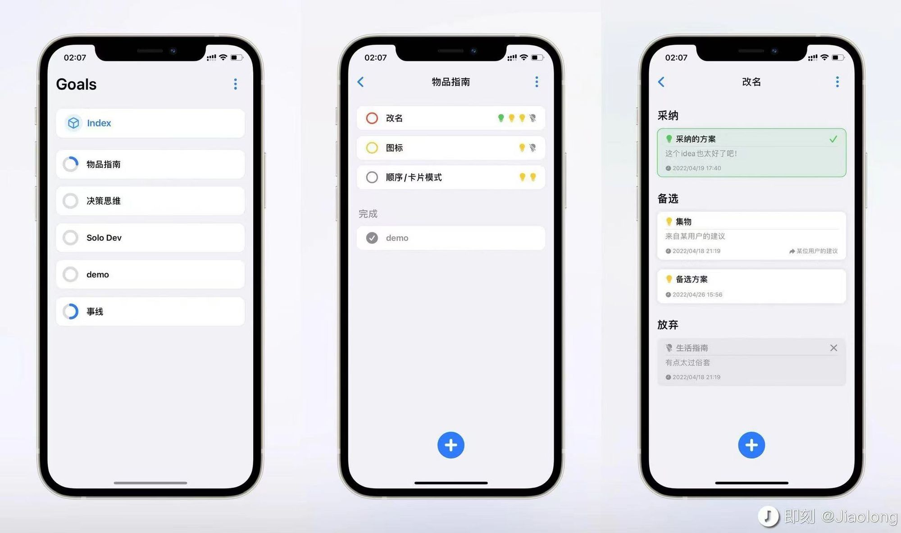

## 新版本上线

兜兜转转终于提交了1.2.0的更新，因为一些测试不到位的地方还有一些小但是会影响体验的小bug，于是连续提交了两个fix版本。

本次更新主要把首页进行了改版，之前需要把收藏、最近等tab作为子tab呈现是因为他们应该作为一个合集体现出来，而不是依然置于原有分组。新版中的“全部“，从根本解决了这一问题，也让界面更清爽了很多，同时增加了按编辑排序，更合理的体现出来了”最近编辑“。同时加入了对默认分组的编辑名称，以及对全部的隐藏，使用户更个性化的管理分组的展示。

总体来说对这次改版还是很满意的！

下一步是对编辑进行优化，目前的编辑路径过于影响，可能会导致很多人一时新鲜后就弃用了。

左滑的操作在经过一番实践后发现没有想象中的复杂，不知道为什么之前没有实现出来。之后可以看下应用场景。

## 决策思维

> 不要做“是非题”，要做“选择题”。任何决定都不会比最好的可选方案更好，所有的决定都可以因为有了更好的可选方案而改变。最好的可选方案，常是许多创新想法的组合。 ——《决策思维》
> 

聊到做多种方案时想起来当时看决策思维时一冲动做了个demo，大概就是围绕一个问题记录多种解决方案。

但是在之后被我否掉了，首先，虽然做选择题是要比做是非题要好，但我逐渐发现个人其实很少有遇到需要做多选方案的情景，如果真的有的话其实一瞬间或是稍微思考一下就决定了，很少有机会需要用app记下来慢慢分析利弊，至少对于个人来说使用场景并不高。其次，多选方案其实更像是一种思考方式，而不局限于某个工具，工具是有限的，很难覆盖各个场景。程序员的多选方案是一个个代码分支，设计师的多选方案是photoshop文件或是一组figma文件，各个领域的“方案”是大不相同的，而让大家为了更好的做决策而使用另一个app是完全不合理的。

## MyGallery

偶然又打开了app一次，之前由于种种原因一直被搁置的app，事线的更新也走向正轨了。这个app可以继续完善起来了，其实整体实现的差不多了已经，等把存储路径设置下就可以上线了，又想到的另一个功能感觉十分有用，可以等之后再开发。

app为付费下载制，因为功能足够直观，有没有这个需求非常好区别。初始定价暂定为3元，之后等想做的另一个功能上线后改为6元。