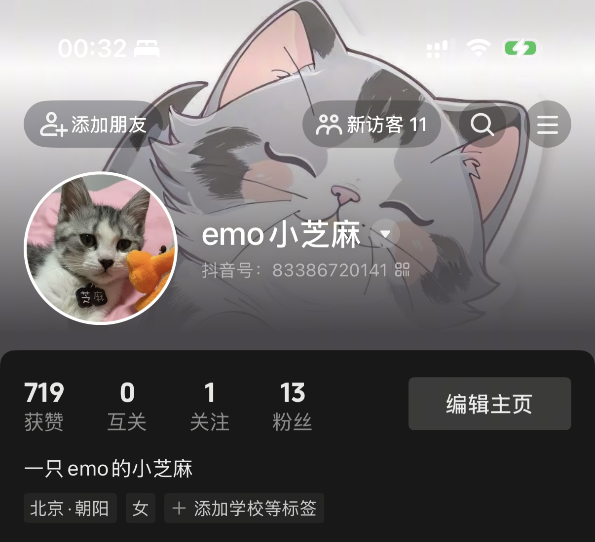

> 最近工作上有点偏极端了，前段时间贼忙，最近又过于安逸了，得自己找活干。

### TL;DR

- 过度的劳累后是过度的空虚
- 借着app准备实现接口的逻辑，研究了下kotin逻辑跨端
- 📷 视觉中国摄影师签约✌️（虽然并没有什么用）
- 准备继续给🐱发点短视频，看看能不能让它给自己给自己挣饭钱

---

### 🧱 搬砖日常

前段时间因为遇到技术改造，每天都很痛苦，终于上线了之后否极泰来，因为做的是客户端，一般做需求都是需要双端（iOS+Android）的人力，但是最近因为组里有Android大佬离职，加上一个校招生临近毕业还没正式入职，所以iOS的人力会多点（多在我身上了），除了和另一个Android实习生做了几个小需求后，我这边基本就处于空置状态。虽然听起来挺舒服，但一直产出太少也不合适，只能尽可能多的做点单端的事。

Android Leader随口问了句要不要做安卓，其实对于我来说倒是都可以，本来就准备补充些android的技能，能直接有项目级实战当然最好不过了，成长会更快点，但是代价是会有更大的压力，需要考虑的问题也要更多，后面看老板怎么安排吧。

另外遇到两个和我做过的需求有关，但不是我引起的bug，基本都是需求的双方都不知道对方的需求，代码也不存在冲突，导致的一些gap。虽然bug不是我引入的，但确实和我做过的需求有关，还是挺难受的，等有空可以跟老板聊聊。

---

### 🧑🏻‍💻 事线更新了吗

最近倒是没有什么大更新，陆续更新了点小功能，值得一提的是前段时间开始了web的内测，所以app的数据同步也是个大问题，像接口这种比较通用的逻辑，如果直接用原生写的话，后面开发Android也要重新再写一遍，效率太低了，于是正好研究了下Kotlin，接入了跨端逻辑实现，之前本来是在工作中学的kotlin，没想到工作中没用到，自己的项目中先用到了。

在实际的接入中发现引入后app体积变得贼大，增量了30MB，前段时间好不容易才降下来。慢慢排查后发现是compose比较大，因为现在还用不上就先把这个模块注掉吧，后面在研究要不要用。

另外说到包体积，目前app涉及的静态图片是以资源的形式保存的，记个todo，后面全换成oss的形式下载吧，到时候应该会再大大降低一波。

目前从平台来说的话，iOS是完成度是最高的，web的功能也慢慢开始增加了，因为后面回考虑尽量把逻辑跨端化，所以也在开始慢慢为Android沉淀基础能力，后面等Android正式立项后就会很快了。最近也在考虑买个安卓备用机，等过几个月看看vivo 300系列有没有性价比高的，争取到时候也开始Android的开发。

**插曲**

在接入Kotlin后，正好要修一个bug，发现一直显示“二进制文件无效”，修改了好几次之后还是失败，第一次见这个，最后无奈发了个邮件问问具体情况，希望能早点解决。

额，最后发现是xcode版本的问题，老版本就能正常，16.4就不行了，回头研究下。

**写不完的Bug**

最近被用户吐槽更新有bug，毕竟确实影响了用户体验，也只能立正挨打了。独立开发的难处在于精力太少了，因为项目体量本身就很小，在迭代功能的时候也在不断优化/重构代码，虽然从技术层面看是个好事，但对于用户来说并没有太大感知，但却大大增加了bug率，自己也不能做到完全的100%全量测试，只能后面多花点心思测试下住流程吧。

---

### 💰 理财

**基金**

> 定投中：纳指+标普500+黄金

总收益还不错，黄金本来能有个不错的收益的，结果跌来跌去差点变成浮亏了，后面再拿拿看看。

本来说要买美股的，一直没去搞港卡，就当省钱了。

---

### 🐱 起号！

之前就给芝麻开了个抖音号好久没发视频了，后面准备偶尔也发一发视频，包括自己的号，毕竟这个时代说不定哪个视频就爆火了，毕竟流量的基数这么大，让芝麻靠自己的能力吃上饭也不一定。

---

### 😾 再次开始战痘

应该是从初中开始，不知道为啥就断断续续的长痘，也去医院看过，感觉用处也不大，加上学生时代也没啥积蓄花钱去处理。现在工作了可以好好整顿下皮肤了，最近也是碰上炎症比较厉害，先后去了空总和中医院，中西医结合，内服外抹统统用上。本来准备研究下怎么刷酸的，正好室友认识的有美容院的主任，于是又开始了美容院的方案，配合着做滚针、刷酸、针清，后续可能还要做微针，希望有用吧🙏

