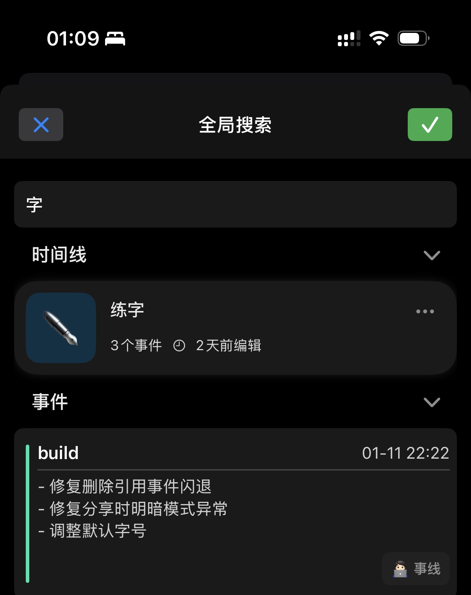
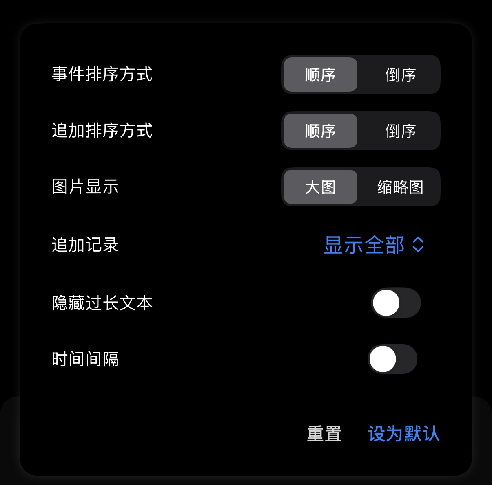
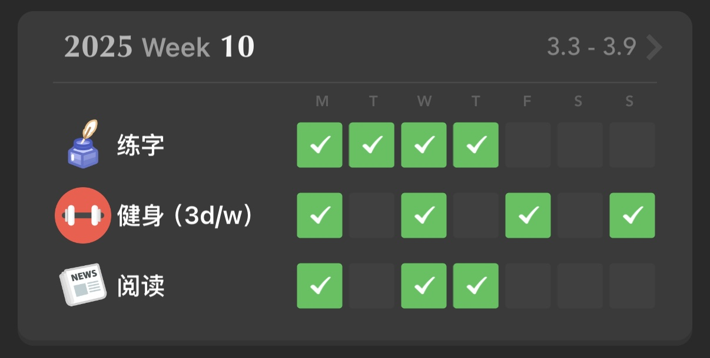

::: info TL;DR

- 事线增加了投票的模块。新增了日历的1.0版本，后面再新增其他的功能
- 收了个新镜头35mm2.8，作为挂机头，还挺满意的
- 又好久没去健身了…
- …
:::

---

### 事线

#### 功能

- [x] 时间线名称搜索
- [x] 允许在偏好设置里隐藏日历Tab
- [x] 点击时间线名跳转至对应列表
- [x] 列表设置逻辑优化

新功能做的倒不是很多，等性能优化做的差不多了就可以开始搞些真正有趣的功能了。

列表设置本来是为了区分全局设置和单时间线设置的，但原有逻辑不太容易理解故本次也进行了改造，加入“重置”和“设为默认”两个按钮，简化链路，这里也是受到Linear的启发。

后面会抽空优化编辑页面的，也是诟病好久了，本期看看能不能安排上。

- [ ] 新编辑页面

#### bug fix & 性能优化

- [x] 启动app过慢问题
- [x] 部分操作卡顿
- [x] 日历事件未刷新
- [x] 日历模式选择失效
- [x] …

近期有同学反馈打开app较慢，于是排查了一番，还是挺吓人的，在启动app时包括在主页的部分操作会频繁访问数据库，导致IO过大，个人的数据量应该算是适中，但在简单的一些操作下来，数据库的IO耗时已经累计到了几千毫秒也就是几秒。虽然听起来不是很多但体感上的还是很明显的。

因为之前对数据访问的代码做过重构，还没有进一步做优化，所以上升空间还是很大的。本次在做了缓存优化后同样的一番操作下来累计耗时下降至20毫秒，骤降至原耗时的1/200。体感上丝滑的多了，之前没来得及排查的卡顿情况也同样消失，看来是因为同一个问题。

除了缓存外，后面还需优化的地方还有很多，目前因为是纯本地数据库方案，所以大部分数据库读操作都放到了主线程，也是导致体感卡顿的原因之一。后面要改为异步加载，并且要重新设计下数据链路，方便后面接入云端数据做铺垫。

- [ ] 异步加载
- [ ] 数据链路梳理/抽象
- [ ] 调研多数据源（本地/云端）加载方案

除了数据流外，时间线页面目前使用的是懒加载方案，所以就偷懒了下没有做分页处理。随着数据的处理增多，越来越多的处理是在懒加载前置完成的，就导致还是可能会导致加载过慢甚至卡顿。后面要抽空补下坑

- [ ] 时间线分页查询
- [ ] 数据处理尽量延迟在懒加载后 减少无用开销

---

### 🎬 《白日梦想家》

很久之前就听过的片子，也在各种混剪中看到多次了，这周才算把正片看了。看完有点小兴奋，期待自己能早点自给自足，成为自由职业。到时候买辆小米SU7，各个城市旅居，去大自然露营，现在光是想想就感觉就足够满足了，或许到时候也能做个自媒体之类的。

---

🛒 种草

pyq刷到心光大佬的装备，很久之前就种草过这个键盘宏按键，但一直没有剁手的动力，后面再观望观望。¥999

---

### 🧱 搬砖

最近还好不是很忙，但是要准备的事情比较多，一个是人生中的首次晋升答辩，感谢老板能给我提名，因为职级目前相对较低所以可能更多的工作是在按部就班的完成任务，后面想拿高绩效或者连续晋升的话可能要多主动思考做些事情了。

另一个是又快轮到我做部门分享了，还没想好主题，因为部门大佬众多，我的资质应该是相对比较低的了，分享移动端的内容有点班门弄斧的感觉，看看能不能搞一些全栈之类的主题，虽然现在自己也只是入门。正好push下自己推进下web的技术调研。

---

### 🏋️ 自律了吗

#### 健身

月初的健身房自动扣费又提醒我好久没练了，所以这周开始隔一天一次恢复下节奏。断了一两个月了，之前带我的教练都走的差不多了，换了新教练。得多吃了… 鸡蛋🥚吃起来

#### 阅读

最近在看之前订阅的《产品沉思录》，看的内容足够多了之后多少还是能摄入一些的。一些概念还挺有意思，比如资深初学者，来表示虽然已有的技能能达到还可以的水平，但长期止步不前，在专业的人面前一下就会暴露水平。感觉自己就是这种情况，看着好像有几把刷子，但其实只是刚刚入门，但一直没有找到合适的词汇来表述。

#### 练字

既然买了钢笔那还是要练起来的，目前跟着吴老师的字帖一点一点学学。