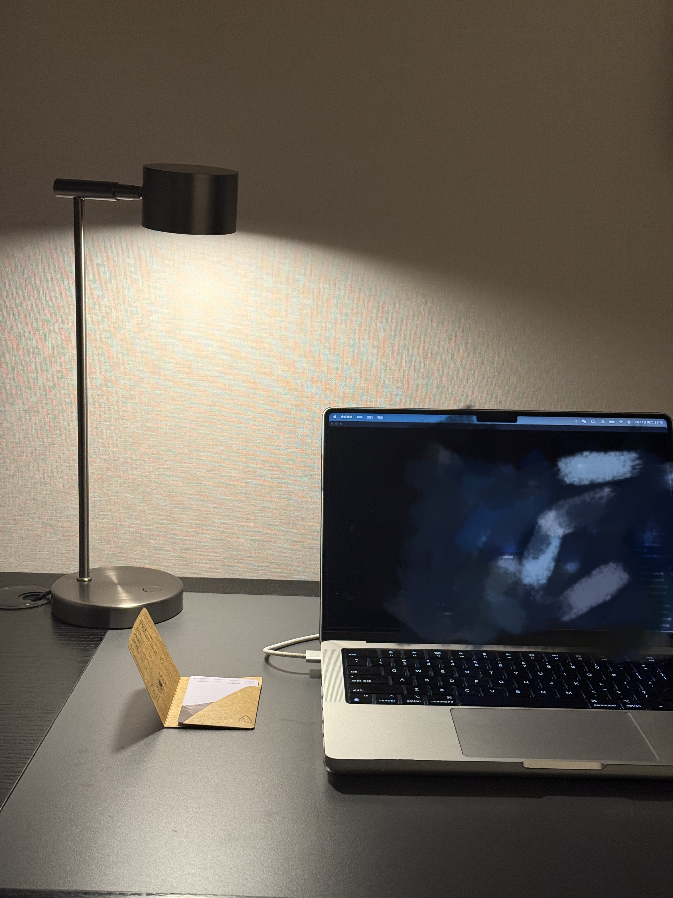
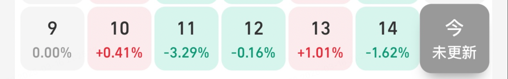
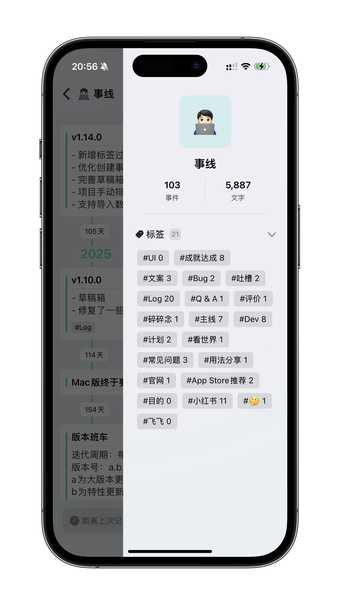

> 去上海出差了一周，加上来回路程，一周感觉没干太多事

### TL;DR

- 上海特种兵式出差
- 又拔了一颗智齿 总进度（2/4）
- 又是财离开我的一周
- 完全没自律（0/7）

---

### 🧱 搬砖日常

本周去上海出差，公司附近开了个亚朵，看了下价格正好卡在出差预算的顶，也算第一次住这么贵的酒店了。几天住下来感觉貌似和CityGo差不多，好点的是起码是有窗户的，CityGo经常住到里间，太闷了。不足的是早餐样式太少了。屋里的氛围灯感觉很nice，后面看看要不要在自己的出租屋搞一个。

---

### 🦷 拔智齿

最近明显感觉到上面的智齿坏掉了，于是光速预约了北大口腔医院的专家号，运气好，卡着点抢到了，虽然是上午的好，一大早六七点就爬起来了。

整体体验还是很好的，明显感觉要比之前在郑州拔的体验好很多，这次在打过麻药之后，不到10s就拔完了，不知道是长得位置好，还是确实医术好，总之体验十分流畅，总共花费约¥800，全部走医保。相比郑州那次拔的时候就很痛苦，感觉明显就是别着另一颗牙拽下来的，半夜还开始流血了，吓得要死，第二天含着一口血包跑去诊所。

---

### 💰 越亏越勇

又是亏麻的一周，纳指感觉跌了得有10%，下周总不能再跌了吧，开始定投加仓，冲！美基也是亏的。比特币做波段小赚10%，出场早了，应该能赚20%的。

---

### 🧑‍💻事线更新了吗

随着功能越来越多，平铺在列表页会越来越乱，于是做了个侧边栏，预计把非一级操作都收进去，也为后面比如热力图做铺垫。等后面出web了，应该也会有类似的侧边栏，也能观感保持一致。

开始着手准备公司注册的事了，想起的名已经有类似的了，不过估计问题不大。等流程走完就能把所有用户群汇总到一起了，到时候沟通会跟统一一些，不用在各个群里发了，也不用每周换一个二维码了。

另外有用户提到出现了一个竞品，甚至英文命名就差了2个字母... emm 很难评，也是项目+时间线+时间间隔，但是因为UI还挺简洁的，也不好说是不是抄袭。作者的小红书提到没有找到合适的时间轴记录app，所以希望没用用过我的吧。

时间轴类的记录方式本来就很普遍，后面难免会越来越多，我也得尽快找到自己的核心功能了。

另一方面物品指南重新又被用户push到，因为最近ai编程的崛起，各种“x物”开始冒出来，但说到底这其实就是个很简单的功能，仅仅是数据的CRUD。最早我做物品指南的时候是为了从notion all in one里解放出来，后面随着功能的越加越多，反而快变成all in one了，而且还没notion好用。等后面有空了之后要做一次大减法，重新迭代起来。

---

### 🐱芝麻的日常

给孩子买了个猫隧道，芝麻自己不希望完，室友的小猫来了之后两只猫打成一团（物理上的打），玩的不亦乐乎，真怕干急眼了。

