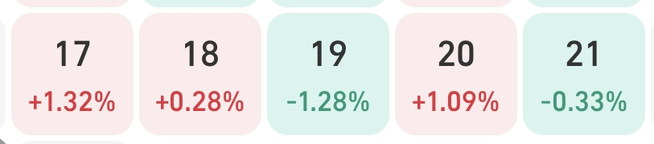
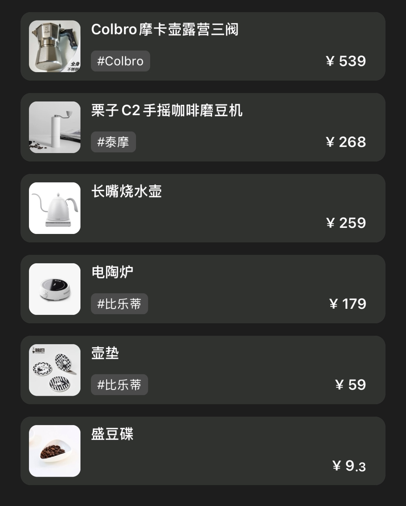

### TL;DR

- 🤖 给部门做了个robot机器人
- 🧑🏻‍💻 提交了v1.17.0的更新
- 🎬 看了《因果报应》
- ☕️ 买了一套摩卡壶装备，准备动手做点咖啡
- 💰 理财有点好转（并不好
- 🐱 芝麻差点跑丢

---

### 🧱 搬砖日常

给部门做了个定时提醒/汇总机器人，能定时提醒排期情况，以及汇总本周任务，方便填入周报，下周正式接入大群，也算为部门留下了点什么。本次写机器人是用Go写的服务，写的很别扭… 一些很神奇的语法，比如大些开头是public的，小写开头是private，引用类型要传指针，写起来感觉还是很别扭的，不像某一种语言，更像是合并了多种语言。

做机器人这个事情确实做完一个就想再做一个，自动化的感觉真的很好，尤其是对程序员来说。

---

### 🧑🏻‍💻 事线更新了吗

- [x] v1.17.0更新
- [x] 侧边栏上线
- [x] 性能优化

提交了v1.17.0的更新，做了些性能优化工作，下周会做点新功能。

---

### 💰 理财

**基金**

> 定投中：纳指+标普500+黄金

本周浮盈

**币**

是的最近又开始炒币了，只做大饼，拒绝高倍，慢慢回本😭

（截止发文前… 又又亏麻了…

---

### 📦 买了什么

终于开始捣鼓咖啡了，入手了摩卡壶以及一系列配件，学渣工具多了属于是。之前一直想买个意式半自动咖啡机，但是租的房子太小了没地方放，而且还贵，还是先入门吧。等齐全了就可以每天早上来一杯了。下周细嗦

---

### 🎬 欢乐时光

周末看了《因果报应》，印度拍的，刚开始的剧情比较一般甚至是无聊/无厘头，过了四分之一左右正式开始进入正片，之后一直到结尾全程高能。

强烈推荐一看！B站就能看。

---

### 🐱 芝麻的日常

室友拿个快递的功夫，还特意看着点小猫怕跑出去的，谁知道还是跑出去了，估计是正好卡到视野盲区。于是和室友一起出动楼层扫描搜索，找了两遍愣是没找到，这时候其实心里才有点慌，怕被别人骗回家。回家拿了逗猫棒又去逐层搜索了下，意外的在楼下两层找到了，感觉是我们找它的时候听见动静了也在动态的跑。

看见我之后赶紧跑过来蹭我手，估计也是吓坏了… 拎回家被室友揍了两巴掌 哈哈哈哈 又怂又爱跑
