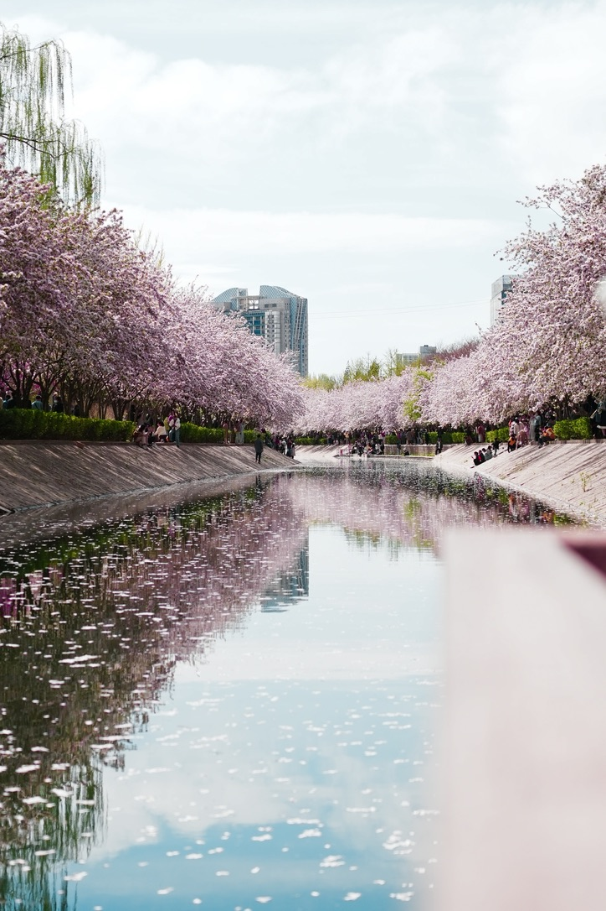
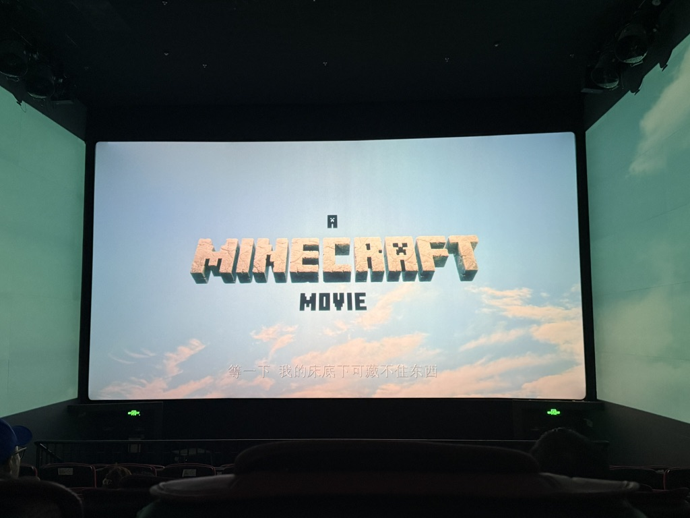
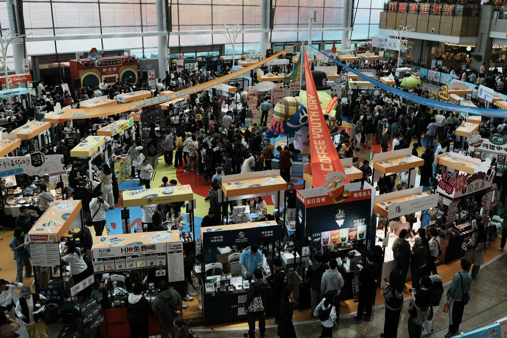
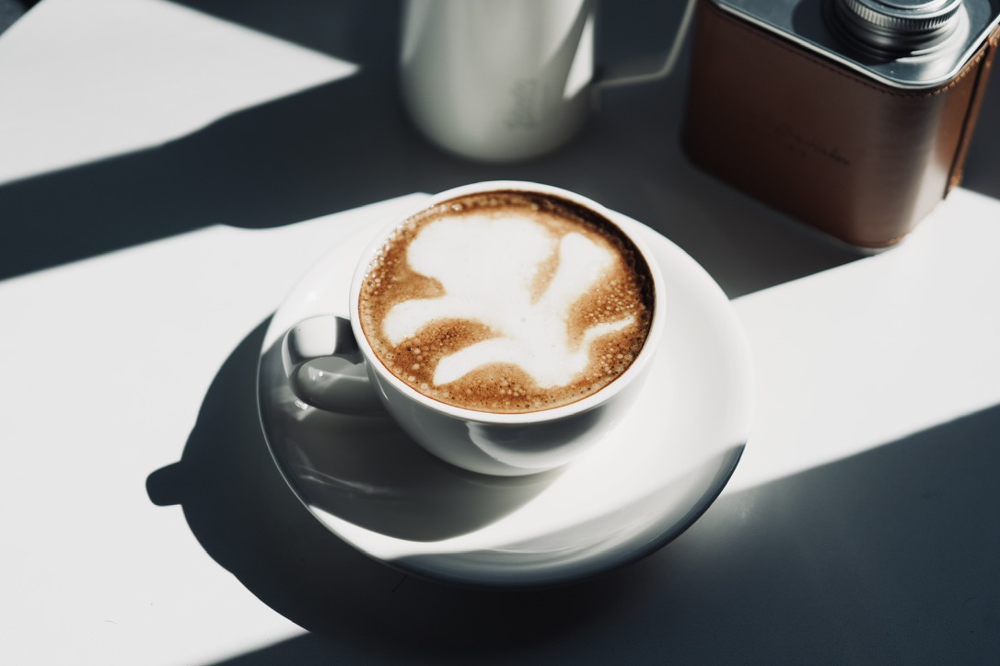

> 不知不觉鸽了两周没写周记，太充实了，没来的及写

### TL;DR

- 咖啡的一套装备终于制备齐了，争取每天早上做一杯。
- 上周末去看了咖啡展
- 🎬 《我的世界》大电影，给3.5⭐️吧
- 事线更新了子时间线，使用姿势又增多了

---

### 🧱 搬砖日常

收到了组里大佬的喜糖，老板大气。

---

### 🧑🏻‍💻 事线更新了吗

- [x] 嵌套子时间线

新增了子时间线的功能，主要用于开辟主时间线的子分支，因为之前大多数情况我会用标签进行某类事件的标记，但是这样的问题是该标签下太多杂碎的事了之后，就会干扰到主时间线，而用追加记录又太过简单，于是把很久之前就有的想法，也就是嵌套子时间线开发了出来，在清理了一波数据后感觉清爽多了。同时发现后面需要新增下多选删除/移动的功能。

这次把无限嵌套时间线作为了高级功能，普通用户仅可以嵌套一层时间线。也是时隔了很长时间后，终于扩充了高级功能。

- [ ] 标签数据链路优化

在做了数据重构之后，不再把所有数据从头至尾的传递了，由各个模块自行管理，但是弊端也暴露出来了，在某一块的数据发生变化时，其他地方的数据并不能及时感知，所以还是需要一个感知变化的监听。

**TODO**

- [ ] 多选操作

---

### 💰 理财

**基金**

> 定投中：纳指+标普500+黄金

币基本又又又归零了，玩不动了。费心费力还费💰，老老实实定投基金吧，后面有时间了买港美股去。

好好好，最近纳斯纳克也是大落小起，继续定投

收益图就不放了

---

### 🎢 玩了什么

清明的时候去拍了望京的海棠花溪，下午逛了顾堤港的咖啡节，看了个电影，过的还算充实。

望京海棠花溪最近开始开花，也算成了个小网红打卡地，各种长枪大炮。但是... 如果没看过网图的话，我会感觉实景很惊艳，但是看过网图之后多少会有点落差，只能说大家的调色水平太高了... 当然肯定还是好看的，只是没有网图那么夸张而已，欢迎近期来玩。

**☕️ 咖啡展**

看到顾堤港有个咖啡展，搜了下离得不远，第二天就直接跑来了

---

**🎬 《我的世界大电影》**

因为之前也玩过这个游戏，所以其实看的过程中自带的滤镜会很重，当游戏里的操作和角色被还原后还是很有感触的，当村民开始哼哼唧唧的时候感觉电影院里的大家都在笑，但是对于一个没接触过我的世界这款游戏的人来说，可能并不是很惊艳。没有技巧，全靠情怀。个人感觉整体还是不错的。

---

### ☕️ 咖啡

装备越来越齐整，也是开始早上做一杯，虽然拉的并不好看，但总比没形状要好哈哈哈哈，大家都说像西兰花🥦。

