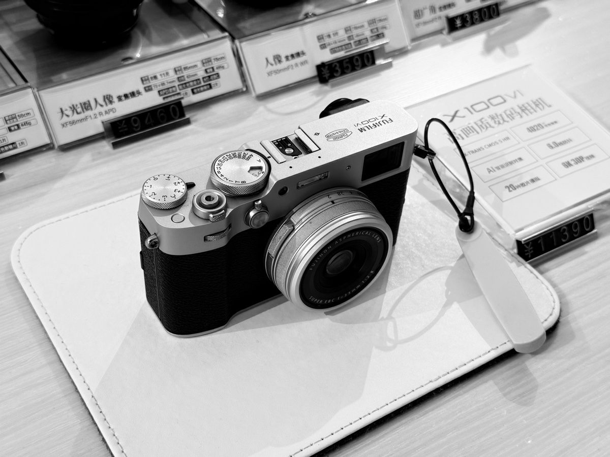

::: info TL;DR
- 事线增加了投票的模块。新增了日历的1.0版本，后面再新增其他的功能
- 收了个新镜头35mm2.8，作为挂机头，还挺满意的
- 又好久没去健身了…
- …a
:::

## 📅 事线｜终于有日历tab了

#### 日历tab

有时候想做的功能有很多，但并不知道用户更倾向于哪个，于是把之前移除的开发计划又加了回来，并做了个简易的投票功能，票数越高，开发的优先级会越高喔～

这期是把日历tab做了出来，当然功能还比较基础，后面还会在这个界面加入更多的功能。

#### 技术迭代

从app上架到现在的时间已经很长了，越来越多的设计缺陷开始暴露出来，比如性能上的不足，功能上的冗余。所以除了业务上的迭代外，也在逐步开始做技术上的整顿。在工作中学到的技能和思考有时候派上用场。越来越像样了哈哈哈哈

---

## 📷 入手了新镜头35mm2.8

一直在用2450g当挂机镜头，但是实在太重了，不是特意准备的出游根本不会想着带出去。于是萌生了买个富士的x100vi当便携机的念头。

好看是真的好看但溢价实在太严重了，根本买不到，又不想当冤大头。于是决定买个便携镜头，平替一下。

最终决定入手35mm2.8，焦段和富士同是35mm，虽然不如富士那么便携，但是颜值和重量倒也还可以，加完遮光罩之后还挺好看的。拿在手里也不会特别重，希望以后能多带出去。

---

## 🎮 终于玩到了黑悟空

周末借组里大佬的PS5爽了一下，刚开始顺着之前的存档玩了下，两刀被二郎神戳死，于是老老实实从新手村学起。

在终于打过了广智之后感觉尾巴飘到天上去了，又去打二郎神，虽然结局没变但已经能多撑一会了。

不得不说云通关和真的自己去玩感觉还是很不一样的，剧情也很有感觉。

只是怕是真的没整块时间去玩。

---

## 学渣工具多系列

#### ✒️ 写乐14k钢笔

不知道又中了什么邪一心想买根钢笔，本来看中了写乐的21k，但上千的价格感觉自己还是有点不配，最终入手了14k的珍珠白。个人还是喜欢钢尖的，对银白色没有抵抗力。

#### 三星T7硬盘

轻便颜值高，立马把之前傻大黑粗的机械硬盘卖了。

---

## 断舍离

好多之前买的但是现在用不到的东西都想着要不留着吧，说不定啥时候就用上了，其实根本不会再用了，最近开始疯狂挂咸鱼，把能出的都卖掉，不然每次收拾东西都要来回整理。

---

## 💰 理财

基金本来是盈利的，结果一周全在亏🥶

最近是月光族，等后面再发工资了开始定投下。

最近小米股票涨的心痒痒，奈何港股还没开户，等下个月去一趟吧
