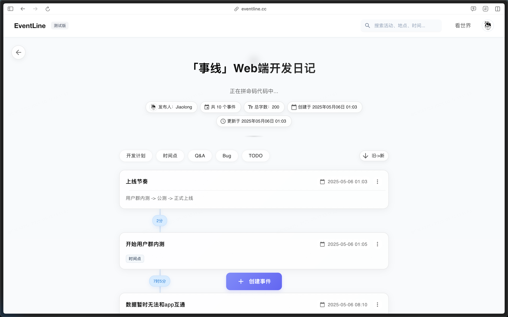

> 拖更了好几期是干大事去了，终于等到了web版本的开发！

### TL;DR

- 开启web端开发，目前已进入到内内测阶段。
- app的更新会放缓，服务于Web
- 又又好久没去健身了，下周得恢复了
- 体验了cursor，在小型项目上确实大有提效

---

### 🧱 搬砖日常

最近在一个周期很长的需求里泡着，代码总共没写多少但是由于种种原因，搞的参与需求的人都很难受，还涉及到跨部门协作，不知道后面能不能按期交付。

晋升结果貌似是出来了，应该是好消息，虽然还没正式通知。后面应该会承担更多的责任，加油干吧！

拖了好几周的部门分享了，本来打算分享下SwiftUI类似的声明式布局，但是简单写了写ppt发现自己的了解还是写业务居多，一些底层的原理设计其实并不了解，所以能讲的其实也十分有限，所以干脆放弃。正好最近在研究如何设计数据库的ID，学到了好几种ID生成方案，感觉可以展开讲讲，东西不多，但是能讲的有理有据，加上本组是做客户端的，所以数据库应该也算是额外的专业知识了，很好。

---

### 🧑🏻‍💻 事线Web正式启动！

网页版因为涉及的内容比较多迟迟没有进入开发，近期也是一咬牙开始写代码了。

肝了一段时间后现在也是开始了内内测，需要完善的基础功能还有很多。后面会在功能基本完善后开启公测，最后正式上线。提到网页端对于开发者除了写代码外最大的事就是该如何收费，因为和app端开发不一样的是服务器将会有一大笔持续性成本在服务器上，所以对于网页版的收费方案只有订阅这一种方式。

当然大家也不用听到收费就望而却步，作为一个理想化的开发者，我不会在一些基础功能上做任何限制，比如只能记录xx条数据、订阅才能同步数据等等吃相难看的操作，（但是对于图片/附件等占据服务器的大头还说肯定还是要限制的，将会有一个合理的免费额度，满足轻中度的使用，不会记两下就弹窗额度不足）

目前的开发进度是完成了40%的基础功能的开发，后面会在把能力完善后开始设计各端的数据同步方案，涉及到数据的异步读写以及覆盖，还是要好好设计下机制的。

---

### 💰 理财

**基金**

> 定投中：纳指+标普500+黄金

最近一周的纳指开始发力了，之前亏的也终于回本了，看后面能不能有更多收益吧，黄金在持续上涨后终于开始回调站稳，不知道后面还会不会继续上涨了。

好久没碰币了，最近比特币居然又站上了10W，大家都在赚钱，只有我是亏麻了😮‍💨

---

### 📦 买了什么

**iPod touch7**

不知道知道这个产品的伙伴多不多，iPod touch也算是我拥有的第一款苹果产品了，搭载iOS系统，不能插SIM卡，类似一个mp4，相应的价格会便宜一大截。但是可能是销量不佳的原因，终于在2019年停产了，最近也是处于收藏的角度在闲鱼上收了一台，后面准备也拍个视频，更新下b站。

**手机云台**

之前还觉得不会买呢，最近突然涌出拍视频的冲动，装备自然不能少。摄像设备的话感觉相机并不好用，所以决定就用手里的iPhone吧。

周末拿出去试了试，没想到出师不利，在用的black Magic软件居然频频录制丢帧，也不是云台的问题，捣鼓了半天也没搞好，直接卸载了，后面重装一下试试，闹心。想用这个软件的主要原因是拍4k 60hz的log占据空间不会很大，也是影视飓风比较推荐的一个app，能不能做好点呀喂！影响我更新视频的最大元凶！

---

### 🎢 玩了什么

五一准备去阿那亚的，高铁都买好了，假都请好了，去的前一天突然意识到自己完全没必要在假期人这么多的时候去挤，完全可以找个周末再去的，于是果断退票，做一个理智的人。

本来准备趁着周末去逛逛展的，一个lks的相机漂流、一个小鹿的摄影展。小鹿老师的就在旁边798，我是最后一天去的，结果发现人贼多… 在附近逛了一圈回来发现完全没有减少的迹象，甚至更多了… 于是作罢 拐弯回府，下次再见吧。lks的展由于种种原因也没有去成.

